# Scale Nine Slicer

This package now consists of two parts:

1. Runtime components to replace UI.Image with a set of additional capabilities.
2. An editor utility for automatic 9-slice sprite slicing.

## Runtime components

### SlicedImage

A more flexible alternative to UI.Image that allows you to combine different sprite rendering modes.
Technical implementation details, as well as the results of performance tests, can be found in
[my blog](https://utkaka.github.io/posts/9-sliced-image/).

#### Sliced + filled

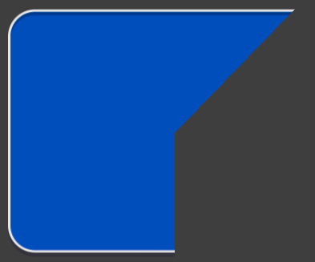

#### Sliced + tiled + filled

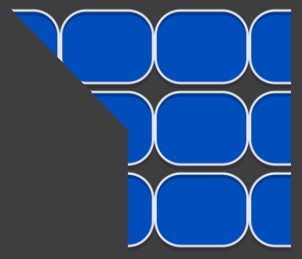

#### Custom filling

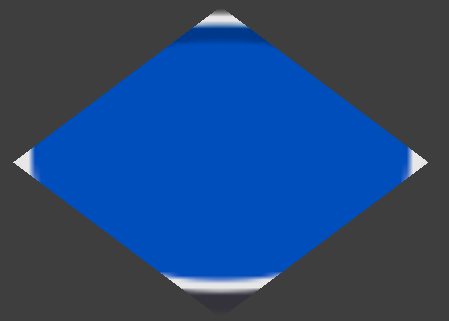

### RoundedImage

Often various progress bars have a capsule shape, which makes using 9-slice difficult:
we can still stretch the sprite along one axis,
but when changing the size along the other axis the capsule becomes a rectangle with rounded corners.
Because of this, for identical horizontal capsules with different heights we have to maintain separate sprites.
RoundedImage solves exactly this problem. It uses the same mechanisms,
as SlicedImage (and therefore supports tiling and the same fill modes),
but builds the mesh using circles instead of rectangles while preserving the stroke thickness.

As a small bonus, this component allows you to save fill rate on large circles.

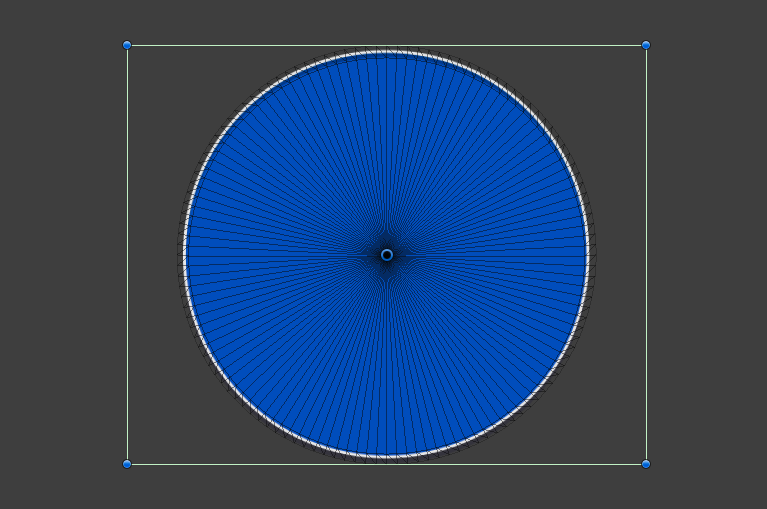

#### Horizontal

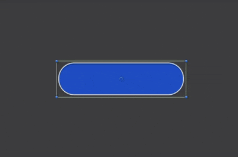

#### Vertical

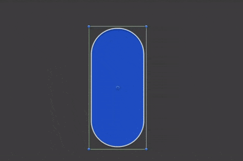

#### Circle

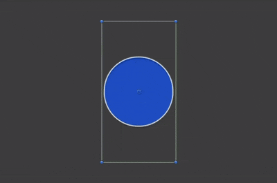

#### Rounded Rect

This mode allows changing corner radii individually, up to obtaining a rectangle (though in this case the corners are not perfect).

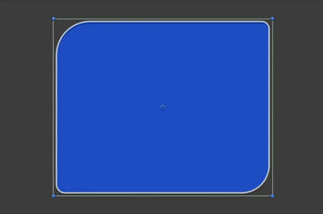

#### Custom filling

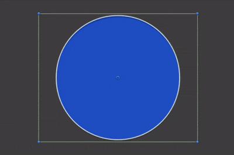

#### Circle with an offset inner center

Sometimes capsules have non-uniform inner shadows. In such cases we can adjust this offset.

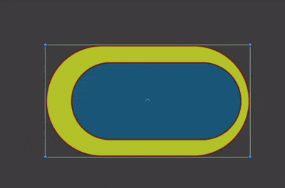

#### Usage

Since Unity does not provide an easy way to store custom data in a sprite asset, for further work
you need to create a separate asset ("2D/Rounded Sprite") in which you specify the sprite itself and the circle parameters.

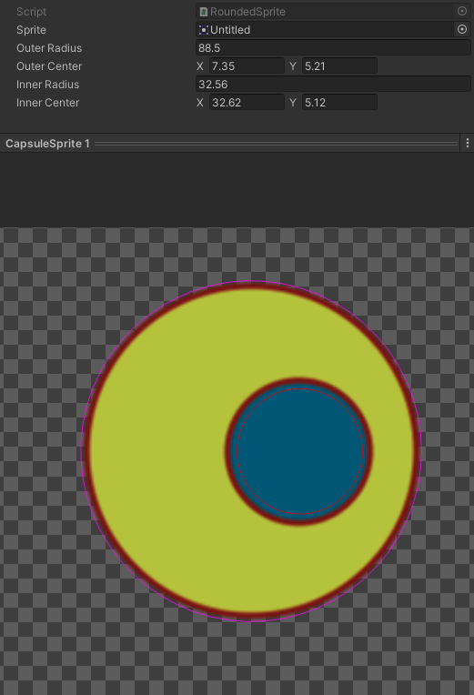

#### Approximation Steps

For potential geometry simplification, you can change the number of points used to construct each quadrant of the circle.

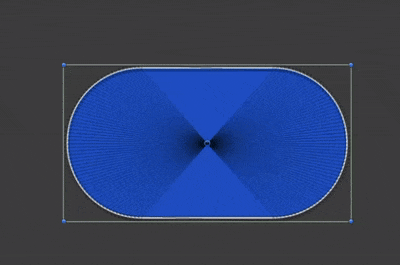

## Editor utility

A tool for automating work with 9 slice scaling in Unity.

### Automatic 9 slice borders detection.

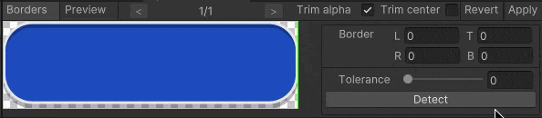

### Trimming sliced sprite center to 1px.

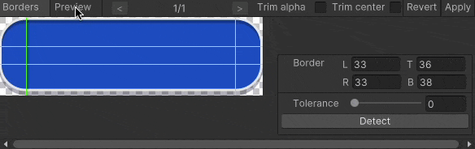

### Trimming extra transparency.

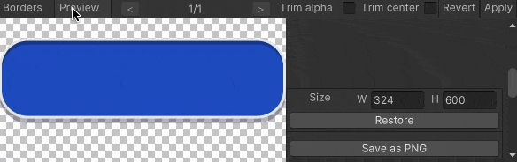

### Usage:

#### Context menu in Project view

You can select textures and/or folders with sprites and perform an action on all contained sprites.

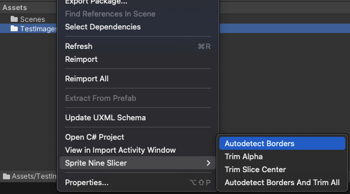

#### Editor window

If you want a more controlled result there is an editor window *(Window/2D/Sprite Nine Slicer)*.

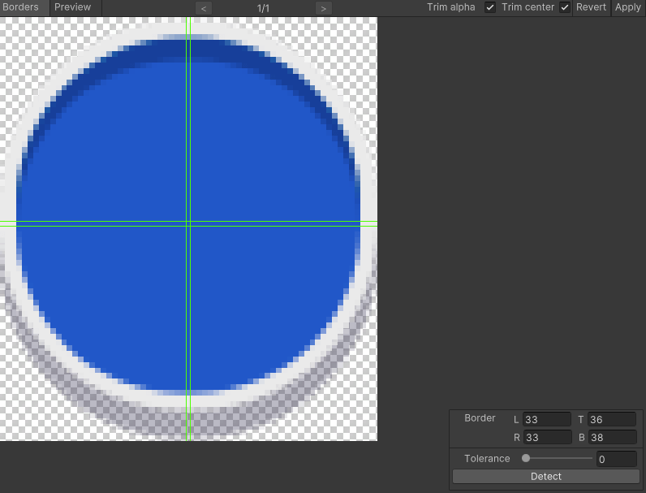

Features:

- Works with multiple selection.
- Manual borders setting. You can zoom with ctrl/cmd key pressed and set borders via input fields or draggable lines on the image.
- You can enable or disable trimmings.
- You can preview the result, extend it to see how it works. Also you can export extended sprite to png.

#### API

Just create an instance of *SpriteInfo* and use it's public API. You can use it both in Unity Editor and at runtime.

## Installation

There are 3 ways to install this plugin:
- clone/download this repository and move the Plugins folder to your Unity project's *Assets* folder
- *(via Package Manager)* add the following line to Packages/manifest.json:
  - "com.utkaka.scale-nine-slicer": "https://github.com/utkaka/ScaleNineSlicer.git",
- *(via OpenUPM)* after installing openupm-cli, run the following command:
  - openupm add com.utkaka.scale-nine-slicer
